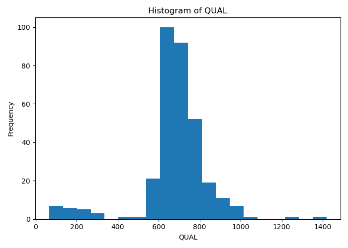
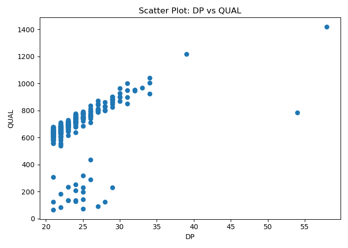
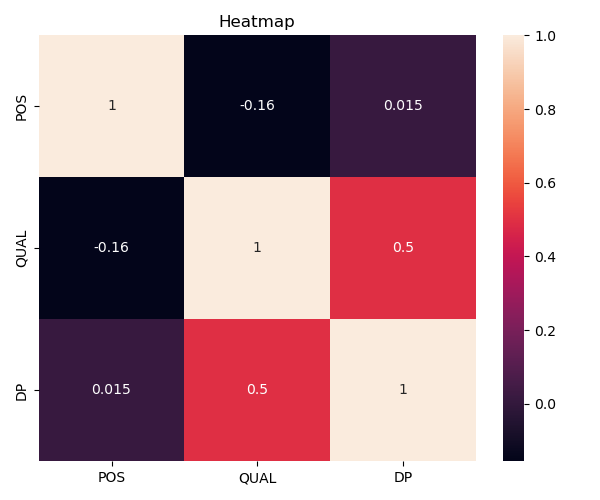

# E. coli Variant Calling Analysis

A bioinformatics project for identifying genetic variants (**SNPs** and **INDELs**) in *Escherichia coli* whole-genome sequencing data using **Snippy**, **bcftools**, and **Python**.

---

## Project Overview

This project analyzes sequencing reads from *Escherichia coli* (SRR2584866) by comparing them against the *E. coli* K-12 MG1655 reference genome. The workflow includes variant detection, quality filtering, statistical analysis, and visualization of the results.

---

## Objectives

- Perform variant calling using Snippy.
- Detect SNPs and INDELs.
- Filter low-quality variants using bcftools.
- Analyze variant quality and read depth.
- Generate tables, plots, and summary statistics.

---

## Dataset

| Item | Description |
|------|-------------|
| Organism | *Escherichia coli* |
| Sample | SRR2584866 |
| Reference Genome | *E. coli* K-12 substr. MG1655 |
| Variant Types | SNPs & INDELs |

---

## Tools & Technologies

- Linux
- Snippy
- bcftools
- Python
- Pandas
- OpenPyXL
- Matplotlib

---

## Workflow

1. Download reference genome.
2. Download sequencing reads.
3. Run Snippy for variant calling.
4. Filter variants:
   - QUAL > 50
   - DP > 20
5. Count SNPs and INDELs.
6. Export TSV and Excel reports.
7. Visualize the results.

---

## Results

| Metric | Before Filtering | After Filtering |
|--------|-----------------:|----------------:|
| Total Variants | 10,374 | 328 |
| SNPs | 9,064 | 290 |
| INDELs | 144 | 4 |

Filtering significantly reduced low-confidence variants while preserving high-quality mutations for downstream analysis.

---

# Data Visualization

## Variant Distribution

---

## Quality vs Read Depth

---

## Variant Heatmap

---

 

## Author

**Lama**

Bioinformatics Student

Princess Nourah bint Abdulrahman University

---

## License

This project is intended for educational and research purposes.
